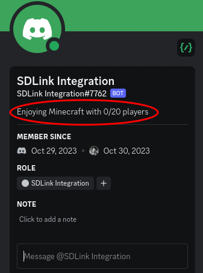
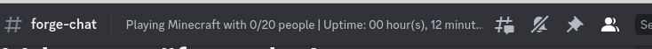
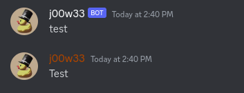
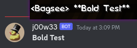
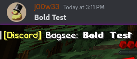
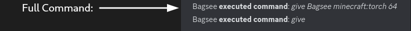
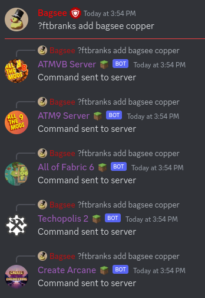

# SDLink Advanced Mod Setup

There are several other options you can enable in the config to further customize your experience.  
Below are the different sections of the config file explained in more detail.

## botConfig

This sections customize how the bot will show in Discord.

See [SDLink Basic Mod Setup](/installation/basic-config.md) for details on setting the `botToken`

```json
[botConfig]
	#The token of the Discord Bot to use. This will be encrypted on first load. See https://sdlink.fdd-docs.com/initial-setup/ to find this
	botToken = ""
	#How often the Bot Status will update on Discord (in Seconds). Set to 0 to disable
	statusUpdateInterval = 30
```

### botConfig.botStatus

This section lets you customize the status that appears in the user panel:
<br>

**Variables**  
`%players%` = number of connected players  
`%maxplayers%` = max player count set in `server.properties`

If `CUSTOM_STATUS` is used, there will be no prefix added to the status message: 

```json
#Control what the Discord Bot will display as it's status message
[botConfig.botStatus]
    #Do not add Playing. A status to display on the bot. You can use %players% and %maxplayers% to show the number of players on the server
    status = "Enjoying Minecraft with %players%/%maxplayers% players"
    #The type of the status displayed on the bot. Valid entries are: PLAYING, STREAMING, WATCHING, LISTENING, CUSTOM_STATUS
    botStatusType = "CUSTOM_STATUS"
    #The URL that will be used when the "botStatusType" is set to "STREAMING", required to display as "streaming".
    botStatusStreamingURL = "https://twitch.tv/twitch"
```

### botConfig.topicUpdates

This allows you to change the channel topic of the chat channel.
<br>

```json
 #Define how the bot should handle channel topic updates on the chat channel
[botConfig.topicUpdates]
    #Should the bot update the topic of your chat channel automatically every 6 Minutes
    doTopicUpdates = true
    #A topic for the Chat Relay channel. You can use %player%, %maxplayers%, %uptime% or just leave it empty.
    channelTopic = "Playing Minecraft with %players%/%maxplayers% people | Uptime: %uptime%"
```

### botConfig.invite

The inviteLink and message will show up when a player in-game runs the `/discord` command

This will allow you to invite players on a public server to the Discord directly from in-game chat

```json
#Configure the in-game Discord Invite command
[botConfig.invite]
	#If this is defined, it will enable the in-game Discord command
    inviteLink = ""
    #The message to show when someone uses /discord command. You can use %inviteurl%
    inviteMessage = "Hey, check out our discord server here -> %inviteurl%"
```

## channelsAndWebooks

These settings allow you to configure the channel IDs as well as webhook URLs

`serverAvatar` is a direct link to the image you wish to use for the embeds and webhook messages. An example would be: "https://i.imgur.com/5DnHbTs.png"  
`serverName` will be the name of the server as it sends messages via webhooks

```json
#Config relating to the discord channels and webhooks to use with the mod
[channelsAndWebhooks]
	#A DIRECT link to an image to use as the avatar for server messages. Also used for embeds
	serverAvatar = "https://i.imgur.com/5DnHbTs.png"
	#The name to display for Server messages when using Webhooks
	serverName = "Minecraft Server"
```

### channelsAndWebooks.channels

This section is where you set the different channel IDs  
There are 3 different channels you can configure: CHAT, EVENT, CONSOLE

- CHAT: Any in-game message will come through here. CHAT channel is **required** even if webhooks are enabled.
- EVENT: Any server event will come through here: Examples include: Player join/leave, Server start/stop, Player died, etc.
- CONSOLE: All server console output will come through here.

:::note
Both `eventsChannelID` and `consoleChannelID` are optional. If the EVENT channel is empty, SDLink will default to the CHAT channel for its message destination. The destinations can be manually modified. See *Link to messageDestinations in current document*
:::

```json
#Config relating to the discord channels to use with the mod
[channelsAndWebhooks.channels]
	#REQUIRED! The ID of the channel to post in and relay messages from. This is still needed, even in webhook mode
	chatChannelID = "0"
	#If this ID is set, event messages will be posted in this channel instead of the chat channel
	eventsChannelID = "0"
	#If this ID is set, console messages sent after the bot started will be relayed here
	consoleChannelID = "0"
```

### channelsAndWebhooks.webhooks

This is where you will assign a webhook URL to a channel. Webhook messages are for one way, MC -> Discord communication.  

See [Webhook Setup](/installation/webhook-config.md) on setting up a webhook for a channel

:::note Chat Channel ID Required
Even if webhook messages are enabled, a channelID for CHAT is still required for Discord -> Minecraft messages
:::

```json
#Config relating to the discord Webhooks to use with the mod
[channelsAndWebhooks.webhooks]
	#Prefer Webhook Messages over Standard Bot Messages
	enabled = false
	#The URL of the channel webhook to use for Chat Messages. Will be encrypted on first run
	chatWebhook = ""
	#The URL of the channel webhook to use for Server Messages. Will be encrypted on first run
	eventsWebhook = ""
	#The URL of the channel webhook to use for Console Messages. DOES NOT WORK FOR CONSOLE RELAY! Will be encrypted on first run
	consoleWebhook = ""
```

## chat

This section lets you decide what messages are sent through SDLink.  
Most of these are self-explanatory, but there are a few that aren't so obvious:

**useLinkedNames**: Allows in-game messages to appear as though they were sent from Discord. It only works if the account is linked via *link to access control config*, and only works if webhooks are enabled.
<br>

**formatting**: Whether or not formatting will be converted between Discord and MC. Example Below:  
Sending a message in bold
<br> 

**relayTellRaw**: This will send in-game "TellRaw" commands through to Discord. *Currently experimental*

**relayFullCommands**: Whether the in-game commands will be relayed in full or just the name:
<br>

**ignoreBots**: This will stop any bot text from being relayed from Discord -> MC. Good to help prevent in-game chat spam

**broadcastCommands**: enable or disable in-game commands from being sent to Discord.

**allowMentionsFromChat**: This will let you mention Discord Users and channels from in-game. *Requires the mod to be installed on the client*
See *link to mentions feature*

```json
#Configure which types of messages are delivered to Minecraft/Discord
[chat]
	#Use linked account names in Discord/Minecraft messages, instead of the default ones
	useLinkedNames = true
	#Convert Discord to MC, and MC to Discord Formatting
	formatting = true
	#Should console messages be sent to the Console Channel
	sendConsoleMessages = false
	#The type of image to use as the player icon in messages. Valid entries are: AVATAR, HEAD, BODY, COMBO
	playerAvatarType = "HEAD"
	#Should messages sent with TellRaw be sent to discord as a chat? (Experimental)
	relayTellRaw = true
	#Should the entire command executed be relayed to discord, or only the name of the command
	relayFullCommands = false
	#Should messages from bots be relayed
	ignoreBots = true
	#Should SERVER STARTING messages be shown
	serverStarting = true
	#Should SERVER STARTED messages be shown
	serverStarted = true
	#Should SERVER STOPPING messages be shown
	serverStopping = true
	#Should SERVER STOPPED messages be shown
	serverStopped = true
	#Should the chat be relayed
	playerMessages = true
	#Should Player Join messages be posted
	playerJoin = true
	#Should Player Leave messages be posted
	playerLeave = true
	#Should Advancement messages be posted
	advancementMessages = true
	#Should Death Announcements be posted
	deathMessages = true
	#Should Messages from the /say command be posted
	sendSayCommand = true
	#Should commands be posted to discord
	broadcastCommands = true
	#Commands that should not be broadcast to discord
	ignoredCommands = ["particle", "login", "execute"]
	#Allow mentioning discord roles, users and channels from Minecraft Chat
	allowMentionsFromChat = false
```

## messageFormatting

This section lets you customize the messages being sent between Discord and MC  
With the exception of `mcPrefix`, All options are being sent MC -> Discord

:::note
Messages being sent support most of Discord formatting (Markdown): eg, `**Bold**`, `*Italics*`
:::

```json
#Change the format in which messages are displayed
[messageFormatting]
	#Prefix to add to Minecraft when a message is relayed from Discord. Supports MC formatting. Use %user% for the Discord Username
	mcPrefix = "§e[Discord]§r %user%: "
	#Server Starting Message
	serverStarting = "*Server is starting...*"
	#Server Started Message
	serverStarted = "*Server has started. Enjoy!*"
	#Server Stopping Message
	serverStopping = "*Server is stopping...*"
	#Server Stopped Message
	serverStopped = "*Server has stopped...*"
	#Player Joined Message. Use %player% to display the player name
	playerJoined = "*%player% has joined the server!*"
	#Player Left Message. Use %player% to display the player name
	playerLeft = "*%player% has left the server!*"
	#Achievement Messages. Available variables: %player%, %title%, %description%
	achievements = "*%player% has made the advancement [%title%]: %description%*"
	#Chat Messages. THIS DOES NOT APPLY TO EMBED OR WEBHOOK MESSAGES. Available variables: %player%, %message%
	chat = "%player%: %message%"
	#Death Messages. Available variables: %player%, %message%
	death = "%player% %message%"
	#Command Messages. Available variables: %player%, %command%
	commands = "%player% **executed command**: *%command%*"]
```

## messageDestinations

This section allows you to pick what Discord channel some messages are sent to.
You can also choose to use embeds for some messages

For more information on embeds, see [Custom Embeds](/features/custom_embeds.md)

```json
#Change in which channel messages appear
[messageDestinations]

    #Control where CHAT messages are delivered
    [messageDestinations.chat]
        #The Channel the message will be delivered to. Valid entries are CHAT, EVENT, CONSOLE
        channel = "CHAT"
        #Should the message be sent using EMBED style messages
        useEmbed = false
        #Embed Layout to use
        embedLayout = "default"

    #Control where START messages are delivered
    [messageDestinations.start]
        #The Channel the message will be delivered to. Valid entries are CHAT, EVENT, CONSOLE
        channel = "EVENT"
        #Should the message be sent using EMBED style messages
        useEmbed = false
        #Embed Layout to use
        embedLayout = "default"

    #Control where STOP messages are delivered
    [messageDestinations.stop]
        #The Channel the message will be delivered to. Valid entries are CHAT, EVENT, CONSOLE
        channel = "EVENT"
        #Should the message be sent using EMBED style messages
        useEmbed = false
        #Embed Layout to use
        embedLayout = "default"

    #Control where JOIN messages are delivered
    [messageDestinations.join]
        #The Channel the message will be delivered to. Valid entries are CHAT, EVENT, CONSOLE
        channel = "EVENT"
        #Should the message be sent using EMBED style messages
        useEmbed = false
        #Embed Layout to use
        embedLayout = "default"

    #Control where LEAVE messages are delivered
    [messageDestinations.leave]
        #The Channel the message will be delivered to. Valid entries are CHAT, EVENT, CONSOLE
        channel = "EVENT"
        #Should the message be sent using EMBED style messages
        useEmbed = false
        #Embed Layout to use
        embedLayout = "default"

    #Control where ADVANCEMENT messages are delivered
    [messageDestinations.advancements]
        #The Channel the message will be delivered to. Valid entries are CHAT, EVENT, CONSOLE
        channel = "EVENT"
        #Should the message be sent using EMBED style messages
        useEmbed = false
        #Embed Layout to use
        embedLayout = "default"

    #Control where DEATH messages are delivered
    [messageDestinations.death]
        #The Channel the message will be delivered to. Valid entries are CHAT, EVENT, CONSOLE
        channel = "EVENT"
        #Should the message be sent using EMBED style messages
        useEmbed = false
        #Embed Layout to use
        embedLayout = "default"

    #Control where COMMAND messages are delivered
    [messageDestinations.commands]
        #The Channel the message will be delivered to. Valid entries are CHAT, EVENT, CONSOLE
        channel = "EVENT"
        #Should the message be sent using EMBED style messages
        useEmbed = false
        #Embed Layout to use
        embedLayout = "default"

    #Control where messages that match none of the above are delivered
    [messageDestinations.custom]
        #The Channel the message will be delivered to. Valid entries are CHAT, EVENT, CONSOLE
        channel = "EVENT"
        #Should the message be sent using EMBED style messages
        useEmbed = false
        #Embed Layout to use
        embedLayout = "default"
```

## accessControl

This section allows you to have a "white-list" based on Discord roles.

See [Access Control](/features/whitelisting.md) for a more indepth guide on setting this up

```json
[accessControl]
    #Enable Access Control
    enabled = false
    #Does the player need to be a member of your discord to join
    requireDiscordMembership = false
    #Optional: The player requires any of these roles to be able to join your server
    requiredRoles = []
    #Optional: Players with these roles will never be allowed access to your server
    deniedRoles = []
    #Optional: Role name or ID to assign to verified player accounts
    verifiedRole = ""
    #Should players with verified accounts, be banned from Minecraft if they get banned on discord
    banPlayerOnDiscordBan = false
    #Should members with verified accounts, be banned from discord when they are banned on Minecraft
    banMemberOnMinecraftBan = false
```

### accessControl.verificationMessages

Allows you to customize the messages that appear when accessControl is enabled.

```json
#Configure messages shown to players when they don't meet verification requirements
[accessControl.verificationMessages]
    #The message shown to players that are not verified
    accountVerification = "This server requires account verification. Your verification code is: {code}. Please visit our discord server for instructions on how to verify your account."
    #Message to show to players that are not a member of your discord
    nonMember = "Sorry, you need to be a member of our discord server to join this server"
    #Message to show when player doesn't have one of the required roles. Use {roles} to display the names of configured roles
    requireRoles = "Sorry, but you require any of the following roles: {roles}"
    #Message to show when player has a role from the deniedRoles list
    roleDenied = "Sorry, but you are not allowed to access this server."
```

## minecraftCommands

This allows you to execute in-game commands from Discord

:::note Multiple Servers
If you have multiple sdlink bots on the same Discord server, you may want to change the prefix for the commands.
If the prefix is the same, the command will be triggered on all servers at once.
<br>
:::

See [Linked Commands](/features/linked-commands.md) for more details on how this works

```json
#Execute Minecraft commands in Discord
[minecraftCommands]
    #Allow executing Minecraft commands from Discord
    enabled = false
    #Command Prefix. For example ?weather clear
    prefix = "?"
    #List of command permissions
    permissions = []
```

## ignoredMessages

This allows you to ignore certain messages from being relayed to discord or to replace words in messages

see *link to mod features message filtering* for more details on how this works

```json
#Configure messages that will be ignored when relaying to discord
[ignoredMessages]
    #Filter certain types of messages from being relayed back to discord
    ignoredMessages = true
    #List of entries to process
    entries = []
    #Ignore messages sent from certain threads
    ignoredThreads = []
```