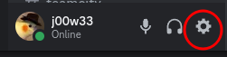
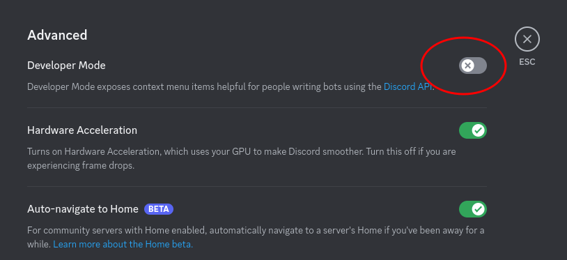
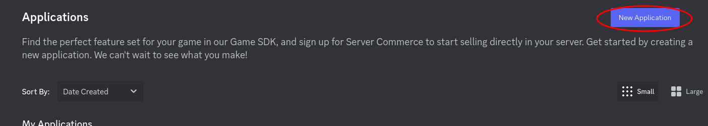
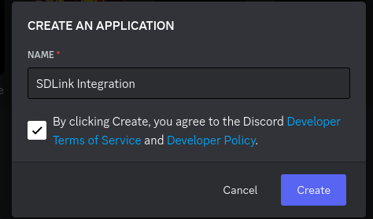
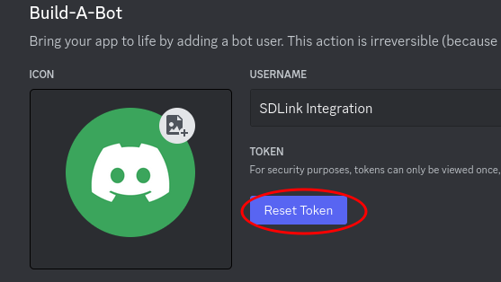
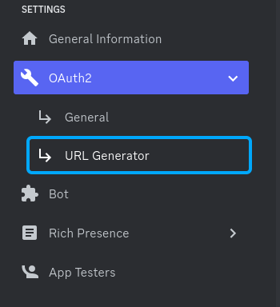
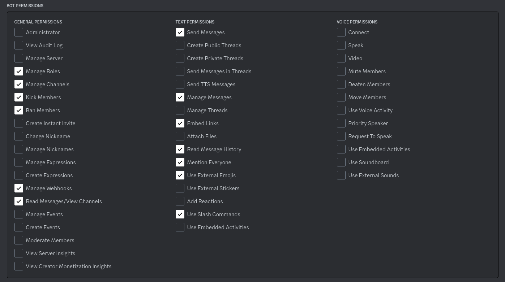

# SDLink Setup

## Discord Bot

### Enable Developer Mode

Although it's not required, It helps to enable "Developer Mode" on your Discord account.

Go to your Discord Settings  

Scroll through the side panel and select "Advanced" in the **App Settings** section  

Toggle Developer Mode  

### Creating the Bot

Go to [https://discord.com/developers](https://discord.com/developers)

Select "New Application" in the top right  

Give it a name, Agree to the Discord EULA, and click "Create"

:::NOTE Naming Convention
Even though it will let you, Don't put "Discord" in the name of the application, or you're gonna have a bad time.
The Bot can't have "Discord" in the name, and it uses the Application name as the default bot name.
:::

### Configuring the Bot

#### Token and Intents

In the **BOT** Section click "Reset Token" to generate a private token. This is how SDLink knows which bot to send the commands to. Make a note of the token. once you leave this page, you won't be able to see it and will have to reset it again.  

:::DANGER DO NOT SHARE THE BOT TOKEN
It's important that you don't share this bot token with anyone. It is essentially the password for your bot. If the token is leaked anyone can use it for their own program and will have access to your Discord server.
:::

Ensure all options in "Privileged Gateway Intents" are checked. These are needed for the bot to function.  

#### Permissions

Go to "OAuth2" >> "URL Generator" on the side panel  

Select "bot" in the **SCOPES** section. This will reveal a separate section for **BOT PERMISSIONS**  

In the **BOT PERMISSIONS** section, enable the following:

- Manage Roles
- Manage Channels
- Ban Members
- Manage Webhooks
- Read Messages/View Channels
- Send Messages
- Manage Messages
- Embed Links
- Read Message History
- Mention Everyone
- Use External Emojis
- Use Slash Commands

Use the **GENERATED URL** at the bottom of the page to invite the bot to your discord channel
