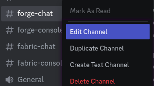
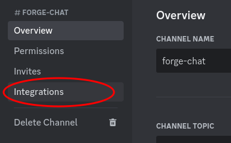
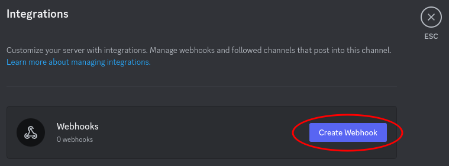
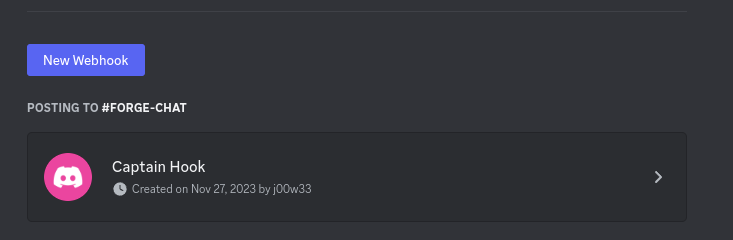
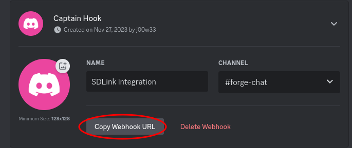

# Webhook Setup

In order to use the webook messages, you need to add a webhook integration to the channel you want the messages to go to.

!!! Webhook vs Embeds
Webhooks are not required for embedded messages. They are both separate from each other.
!!!

Right-Click -> Edit Channel on the channel you want to send webhooks to. In this example I'm using the **Chat** channel
 

Select **Integrations** on the side
 
warning callout format
Click "Create Webhook"
 

You now have a webhook:
 

Click the webhook to expand it.

Change the name (if you want) and click "Copy Webhook URL"
 

!!!warning Keep the Webhook URL Private
The webhook url contains sensitive server information and needs to be kept private.
When you start the server after adding the url to the config, the url is encrypted.
!!!
